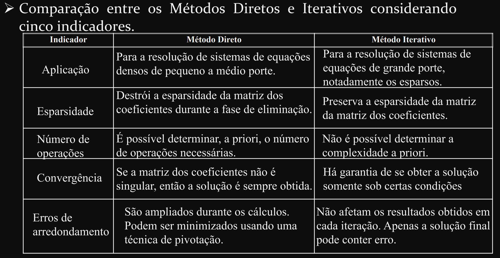

# Numerical methods

## Bibliography

Main:
- **Chapra, S., 2011. Applied Numerical Methods with MATLAB for Engineers and Scientists. McGraw Hill**.

Others:
- **Dahlquist, G. and Björck, Å., 2003. Numerical methods. Courier Corporation** - A alternative material for Chapra. Basically, it seems to the same contents as Chapra (and in the same depth level).
- **Kreyszig, E., Stroud, K. and Stephenson, G., 2008. Advanced engineering mathematics** - For analytical solutions of ODEs (Part A, chap 1-6) and PDE (chapter 12).
- **Hoffman, J.D. and Frankel, S., 2018. Numerical methods for engineers and scientists. CRC press** - It seems to be a more advanced book, with a special focus on algorithms for ODEs and PDEs problems. More advanced algorithms that aren't found on Chapra might be found here.
- **Press, W.H., 2007. Numerical recipes 3rd edition: The art of scientific computing. Cambridge university press** - A good reference for implementation of Numerical Methods in C. It is also a good reference for the theoretical aspects.

---

## Summary

- [Root-finding problems](https://github.com/tapyu/courses/tree/main/numerical-methods#root-finding-problems-part-ii-on-chapra-chapter-6-and-7-chapter-6-dahlquist-chapter-3-on-hoffman)
- [ODE- and PDE-based problems](https://github.com/tapyu/courses/tree/main/numerical-methods#linear-systems-problems-part-iii-on-chapra)
- [Linear systems problems](https://github.com/tapyu/courses/tree/main/numerical-methods#linear-systems-problems-part-iii-on-chapra)
- [Curve-fitting problems](https://github.com/tapyu/courses/tree/main/numerical-methods#curve-fitting-problems-interpolation-extrapolation-regression-approximation)
- [Numerical differentiation](https://github.com/tapyu/courses/tree/main/numerical-methods#numerical-differentiation-part-v-on-chapra)
- [Numerical integration](https://github.com/tapyu/courses/tree/main/numerical-methods#numerical-integration-chapter-19-and-20-on-chapra)
- [Optimization problems](https://github.com/tapyu/courses/tree/main/numerical-methods#optimization-problems-chap-7-on-chapra)

---

## Methods

---

### [Root-finding problems][30] (part II on Chapra, chapter 6 and 7; chapter 6 Dahlquist; chapter 3 on Hoffman):

Determines the values of $x$ at which the nonlinear function $f(x)$ is zero, that is, the roots or zeros of $f(x)$. The roots of a nonlinear equation $f(x) = 0$ cannot in general be expressed in closed form (i.e., analytically). Even when this is possible, the expression is often so complicated that it is not practical to use it. Thus in order to solve nonlinear equations, we are obliged to use root-finding algorithms, which provide an approximated solutions, expressed either as floating-point numbers or as small isolating intervals.

#### Packages

- [`Roots.jl`][7]:
    - Bisection-like algorithms (the most classic bracket method, see section 5.4)
      - See this [tutorial][16]
    - Newton's method
      - See this [tutorial][15]
    - Chebyshev (it does not have on Chapra. See [here][48])
    - Schroder (it does not have on Chapra)
    - QuadraticInverse (it does not have on Chapra)

---

### [ODE- and PDE-based problems][31] (part VI on Chapra):

Given a ODE/PDE, how to solve it. The solutions to ordinary differential equations (ODEs) can be broadly categorized into two main types: analytical solutions and numerical solutions.
- **Analytical/closed-form solution**: Exact mathematical expressions that represent the solution to the differential equation. Examples include $x(t) = \cos(t)$ for $x + x' = 0$. Analytical solutions often involve systematic methods and techniques such as separation of variables, integrating factors, variation of parameters, Laplace transforms, and others. For a more in-depth solution review, see Erwin Kreyszig, part A and C.
- **Numerical solution**: Provide an approximation to the solution by discretizing the domain and using iterative methods. Examples include Euler's method, Runge-Kutta methods, and finite difference methods. The algorithms shown here falls in this approach.

The key factor that determines which solution one should follow is the problem complexity. If the problem is simple and fall into certain class of ODE problems (e.g., separable ODEs, exact ODEs, linear ODEs, homogeneous and inhomogeneous ODEs, etc), we may solve it analytically. However, **differential equations such as those used to solve real-life problems may not necessarily be directly solvable, i.e. do not have closed form solutions. Instead, solutions can be approximated using Numerical Methods.**

#### Packages

- [`DifferentialEquations.jl`][1]: Numerically solving differential equations written in `julia`. See [all ODE solvers][8]; [recommendation for each situation][9]
    - Runge-Kutta Methods (see 22.4 on Chapra and [wiki][19])
    - Midpoint (see section 22.3.2 on Chapra)
    - Heun (see section 22.3.1 on Chapra)
    - Forward Euler method (see section 22.2 on Chapra)
    - Multistep Methods (see section 23.2 on Chapra)

---

### [Linear systems problems][32] (Part III on Chapra):

Direct and iterative methods to solve linear systems. This topic overlaps with the Linear Algebra contents, but focuses more on the numerical approach to solve Linear system of equations, rather than the theoterical aspects of Linear Algebra. See the [Linear Algebra][33] directory for more info.
- Direct methods (see section 5.3 on Dahlquist or 1.3 on Hoffman):
  - LU decomposition;
  - Gauss Elimination;
  - Gauss-Jordan Elimination;
  - Inverse matrices;
  - Cholesky Decomposition
- Iterative methods (see section 5.6 on Dahlquist or 1.6 on Hoffman):
  - Gauss-Seidel method;
  - Jacobi method;
  - Successive overrelaxation (SOR) method.

#### Packages

Direct methods, such as LU and Cholesky decomposition, are usually performed via built-in function when using scientific programming language, such as Python, Matlab, Julia, and R.

- [`IterativeSolvers.jl`][2]: Iterative algorithms for solving linear systems, eigensystems, and singular value problems. Iterative methods constranst with the direct methods (e.g., Gauss elimination), which requires a finite number of steps to solve a linear system. Examples:
  - Gauss-Seidel method (an interative method for solving linear systems, see chapter 12 on Chapra)
  - Jacobi iteration method (see section 12.1 on Chapra)

    

---

### [Curve-fitting problems][34]: Interpolation, extrapolation, regression, approximation.

"Curve fitting" is an umbrella term that encompasses the following techniques: "interpolation", "extrapolation", "regression", "approximation".

#### [Interpolation][35] (chapter 17 and 18 on Chapra)

Interpolation is a mathematical problem that involves estimating unknown values that fall between known values. In other words, it is the process of constructing a function or curve that passes through a given set of data points. Common types of interpolations are linear, polynomial, spline, and piecewise constant interpolators.

    

[Disambiguation][43]: In the domain of digital signal processing (DSP), the term interpolation may refer to obtaining a continuous-time signal from a digital signal or to increasing the sampling rate of a digital signal to a higher rate (see Oppenheim, chapter 4 ). In the first case, it corresponds to the definition of Numerical Methods, but uses other methods, such as filtering techniques. In the second case, however, it has a different meaning, as we obtain a new set of samples instead of a continuous function.

##### Packages

- [`Interpolations.jl`](https://github.com/JuliaMath/Interpolations.jl)
- [`DataInterpolations.jl`](https://github.com/SciML/DataInterpolations.jl)
  - Linear interpolation
  - Quadratic interpolation
  - Lagrange interpolation
  - Quadratic spline
  - Cubic spline

It is a type of estimation, beyond the original observation range, of the value of a variable on the basis of its relationship with another variable.

#### [Extrapolation][44] (see sec. 7.8 on Hoffman)

Extrapolation is another noteworthy technique, which is similar to interpolation but involves estimating values outside the range of the observed data. It is subject to greater uncertainty and a higher risk of producing meaningless results.

I am not sure how well mature the Numerical Methods for extrapolation are. It doesn't seem the shiniest part of numercal methods. For time series forecasting problems, Statistical signal Processing or Machine Learning techniques might preferable.

Extrapolation techniques are not exposed here.

#### [Regression][36] (see Steven Kay, Fundamentals of Statistica Signal Processing, chapter 14 on Chapra, or other on books)

Regression is a statistical technique to model the relationships between a dependent variable (often called the 'outcome' or 'response' variable, or a 'label' in machine learning parlance) and one or more independent variables (often called 'predictors', 'covariates', 'explanatory variables' or 'features'). The most common form of regression analysis is linear regression, in which one finds the line (or a more complex linear combination) that most closely fits the data according to a specific mathematical criterion.

    

Regression is a transversal topic, used in several areas, from Statistics to Signal Procesisng, and therefore it is not exposed here.

#### [Approximation][39] (Dahlquist, chapter 4)

[Approximation][35] of a complicated function by a simple function. A function approximation problem asks us to select a function among a well-defined class that closely matches ("approximates") a target function. One can distinguish two major classes of function approximation problems:
- First, for **known** target functions [approximation theory][40] is the branch of numerical analysis that investigates how certain known functions (for example, special functions) can be approximated by a specific class of functions (for example, polynomials or rational functions) that often have desirable properties (inexpensive computation, continuity, integral and limit values, etc.).
- Second, the target function, call it $g$, may be **unknown**; instead of an explicit formula, only a set of points in the form $(x, g(x))$ is provided. Depending on the structure of the domain and codomain of $g$, several techniques for approximating $g$ may be applicable.

Approximation methods are not exposed here.

---

### [Numerical differentiation][41] (part V on Chapra)

Numerical differentiation is a broad term encompassing various methods for approximating derivatives. The following [techniques][29] fall under this umbrella:

#### [Finite Difference Methods][42]

Finite difference methods approximate derivatives using the differences between function values at nearby points. Three basic types are commonly considered: forward, backward, central, and higher-order finite differences.

##### Packages (see section 4.3 on Chapra, for high-order numerical differentiation, see chap 21)
- [FiniteDifferences.jl][10] and [FiniteDiff.jl][11] are similar libraries: both calculate approximate derivatives numerically.
    - Backward, forward, and central numerical differentiations.

#### [Automatic differentiation][13] (auto-differentiation, autodiff, or AD) (6.5.9 on Goodfellow, Deep learning)

Automatic differentiation is a computational technique that automatically evaluates derivatives of a function, combining aspects of symbolic and numerical differentiation. AD is more efficient and accurate than traditional numerical differentiation for functions represented as computer programs.

##### packages

- [ForwardDiff.jl][14]: implements methods to take derivatives, gradients, Jacobians, Hessians, and higher-order derivatives of native Julia functions (or any callable object, really) using forward mode automatic differentiation (AD).
- [ReverseDiff.jl][22]: A similar package to `ForwardDiff.jl` (see the differences in the `README.md`).

#### [Symbolic Differentiation][45]

Symbolic differentiation involves to manipulation of mathematical expressions to derive symbolic expressions for derivatives.

---

### [Numerical integration][46] (chapter 19 and 20 on Chapra)

 Numerical integration used to approximate the definite integral of a function when an analytical solution is either impractical or impossible to obtain. We can numerically integrate either a set of samples or an mathematical function (whose closed-form integral is too complicated to calculate analytically).

#### Packages
- **Numerical integration**
  - [`NumericalIntegration.jl`][3]: Simple (maybe not so reliable) numerical integration methods
    - Trapezoidal (default) (See section 19.3 on Chapra)
    - TrapezoidalEven
    - TrapezoidalFast
    - TrapezoidalEvenFast
    - SimpsonEven (See section 19.4 on Chapra)
    - SimpsonEvenFast
    - RombergEven (see 20.2 on Chapra)
  - [`Integrals.jl`][4]: A more reliable numerical integration methods (maybe not all methods are exposed in Chapra)
    - Gauss–Kronrod quadrature formula (a variant of Gaussian quadrature, see [wiki][27])
    - H-Adaptive Integration (Adaptive quadrature? If so, see section 20.4 on Chapra). It uses [`HCubature.jl`][5], which is a `julia` code for the [adaptive multidimensional integration][6]
    - Monte Carlo integration (apparently it doesn't have on Chapra)
    - Gauss-Legendre quadrature (see section 20.3 on Chapra)
    - `integral()` in matlab uses adaptive quadrature (see section 20.4 on Chapra)

---

### [Optimization problems][47] (chap. 7 on Chapra)

The problem of finding the best possible solution to a problem from a set of feasible alternatives. The goal is to identify the optimal solution that either maximizes or minimizes an objective function, subject to a set of constraints.

Although optimization is a numerical methods, it is a more complex technique. Therefore, you can even find a brief introduction of Optmization Theory in Numerical Methods books, but, for this topic, I would suggest going to the [optmization theory course](../optmization-theory).

Optimization algorithms are not exposed here.

---

## Other resources:
- [Awesome STEM academy]
- [Direct vs. iterative methods][20] for solution of linear systems:
  - [advantages and disavantages][21]
  - [wiki: a nice example][28]
- [Wiki: Ordinary and partial differential equations: Explicit vs. implicit methods][17]
- [Wiki: key performance indicators in numerical analysis][18]
- A Hands-on Introduction to Automatic Differentiation towards deep learning - Part [1][23] and Part [2][24]
- `./nootebook/` contains a series of `.ipynb` with tutorials for the `DifferentialEquations.jl` package, which was found in [SciMLTutorials.jl][25] (this repo is deprecated, but the notebooks still useful). See his video tutorial on [Youtube][26]

    
[1]: https://docs.sciml.ai/DiffEqDocs/latest/
[2]: https://iterativesolvers.julialinearalgebra.org/dev/
[3]: https://github.com/dextorious/NumericalIntegration.jl
[4]: https://docs.sciml.ai/Integrals/stable/
[5]: https://github.com/JuliaMath/HCubature.jl
[6]: https://github.com/stevengj/cubature
[7]: https://juliamath.github.io/Roots.jl/stable/
[8]: https://docs.sciml.ai/DiffEqDocs/stable/solvers/ode_solve/
[9]: https://docs.sciml.ai/DiffEqDocs/stable/#Solver-Algorithms
[10]: https://github.com/JuliaDiff/FiniteDifferences.jl
[11]: https://github.com/JuliaDiff/FiniteDiff.jl
[12]: https://juliadiff.org/
[13]: https://en.wikipedia.org/wiki/Automatic_differentiation
[14]: https://juliadiff.org/ForwardDiff.jl/stable/
[15]: https://www.matecdev.com/posts/julia-newton-raphson.html
[16]: https://www.matecdev.com/posts/julia-bisection.html
[17]: https://en.wikipedia.org/wiki/Explicit_and_implicit_methods
[18]: https://en.wikipedia.org/wiki/Numerical_methods_for_ordinary_differential_equations#Analysis
[19]: https://en.wikipedia.org/wiki/Runge%E2%80%93Kutta_methods
[20]: https://www.linkedin.com/advice/0/how-do-you-compare-combine-direct-iterative
[21]: http://www.decom.ufop.br/moreira/site_media/uploads/arquivos/01_selas_new.pdf
[22]: https://github.com/JuliaDiff/ReverseDiff.jl
[23]: https://mostafa-samir.github.io/auto-diff-pt1/
[24]: https://mostafa-samir.github.io/auto-diff-pt2/
[25]: https://github.com/SciML/SciMLTutorials.jl
[26]: https://www.youtube.com/watch?v=KPEqYtEd-zY&ab_channel=TheJuliaProgrammingLanguage
[27]: https://en.wikipedia.org/wiki/Gauss%E2%80%93Kronrod_quadrature_formula
[28]: https://en.wikipedia.org/wiki/Numerical_analysis#Direct_and_iterative_methods
[29]: https://en.wikipedia.org/wiki/Automatic_differentiation#Difference_from_other_differentiation_methods
[30]: https://en.wikipedia.org/wiki/Root-finding_algorithms
[31]: https://en.wikipedia.org/wiki/Differential_equation#:~:text=An%20ordinary%20differential%20equation%20(ODE,%2C%20therefore%2C%20depends%20on%20x.
[32]: https://en.wikipedia.org/wiki/Numerical_linear_algebra
[33]: https://github.com/tapyu/courses/tree/main/linear-algebra
[34]: https://en.wikipedia.org/wiki/Curve_fitting
[35]: https://en.wikipedia.org/wiki/Interpolation
[36]: https://en.wikipedia.org/wiki/Regression_analysis
[37]: https://en.wikipedia.org/wiki/Smoothing
[38]: https://en.wikipedia.org/wiki/Smoothing#Algorithms
[39]: https://en.wikipedia.org/wiki/Function_approximation
[40]: https://en.wikipedia.org/wiki/Approximation_theory
[41]: https://en.wikipedia.org/wiki/Numerical_differentiation
[42]: https://en.wikipedia.org/wiki/Finite_difference
[43]: https://en.wikipedia.org/wiki/Interpolation#In_digital_signal_processing
[44]: https://en.wikipedia.org/wiki/Extrapolation
[45]: https://en.wikipedia.org/wiki/Computer_algebra
[46]: https://en.wikipedia.org/wiki/Numerical_integration
[47]: https://en.wikipedia.org/wiki/Mathematical_optimization
[48]: https://encyclopediaofmath.org/wiki/Chebyshev_method
[Awesome STEM academy]: https://github.com/tapyu/awesome-stem-academy/tree/main#numerical-methods
